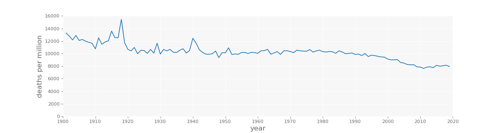
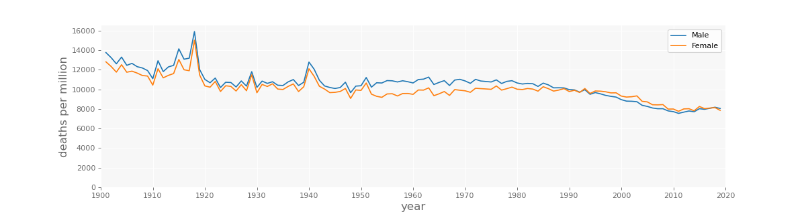
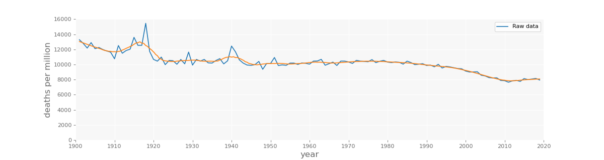
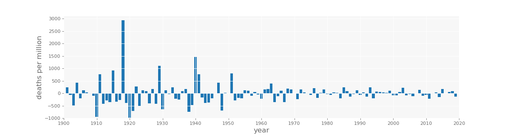
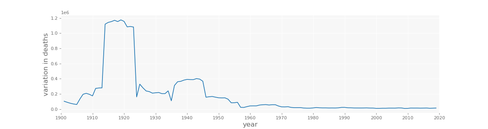

## Aim of project

This analysis is inpired by a [twitter thread](https://twitter.com/VoidSurf1/status/1313777624674709506) by [@VoidSurf1](https://mobile.twitter.com/VoidSurf1). In it he uses publicly available datasets to look at the mortality across the past 120 years in the USA and Sweden. I aim to start by replicating similar figures for the UK and then breaking these down by causes of death. 

The main figures will be found in this document, along with an explanation of them. The analysis can be found in the associated [Jupyter notebook](https://jupyter.org/) and the datasets in the ``Datasets`` folder, allowing anyone to replicate or extend the analysis. The sources of the datasets are shown at the end of this document.

## Current results

To begin with, I have looked at the aggregate number of deaths in the UK each year from 1901 to 2019. These are shown below as deaths per million people living in the UK.

For men and women, the yearly deaths fluctuate in surprisingly similar ways, even in years of conflict.   

To see the overall trends, the data can be smoothed using a moving average. In this case I used [LOESS](https://medium.com/@joao.figueira/loess-373d43b03564), a local polynomial regression, with a window size of 2.5 years. The smoothed estimate can be seen to be a good estimate when overlaid on top of the raw data below. 

The difference between this moving average and the raw values provides information on the yearly fluctuations. In an uneventful period you would expect the fluctuations to be of similar sizes each year and equally likely to be positive or negative. This can best be seen by calculating the estimate residuals: finding the difference between the estimate and raw data, shown below.

From this figure it is possible to see the years during which the UK participated in major conflicts (1918, 1939-1945, 1952) and the years of great suffering, such as the start of the great depression in 1929. Before and after such years the moving average overestimates the expected number of deaths, so the residuals are negative. 

Another thing that is immediately noticeable from the residuals is that the year-to-year volatility decreases as the century progresses. This can be seen more clearly using a estimate of the variance across a moving 10 year window. From this we can see how the past 60 years have have had far weaker _'life-threatening'_ shocks. I expect this to be seen later when I breakdown the causes of death.

My next challenge is in grouping the causes of death in a useful way.

## Data sources

- [The 20th century mortality data.](https://webarchive.nationalarchives.gov.uk/20160108034247/http://www.ons.gov.uk/ons/rel/subnational-health1/the-20th-century-mortality-files/20th-century-deaths/index.html)

- [21st century mortality dataset.](https://www.ons.gov.uk/peoplepopulationandcommunity/birthsdeathsandmarriages/deaths/datasets/the21stcenturymortalityfilesdeathsdataset)

- [The population and demographic data for the UK up to 2014.](https://www.ons.gov.uk/peoplepopulationandcommunity/populationandmigration/populationestimates/adhocs/004356ukpopulationestimates1851to2014)

- [More recent population and demographic data for the UK.](https://www.nomisweb.co.uk/query/select/getdatasetbytheme.asp?)

- [The CDC description of ICD-10](https://www.cdc.gov/nchs/icd/icd10.htm) has a copy of the [mortality cause list](ftp://ftp.cdc.gov/pub/Health_Statistics/NCHS/Publications/ICD10).

### As of yet unused datasets
- [The ONS discussion on the 20th century mortality data](https://www.ons.gov.uk/peoplepopulationandcommunity/birthsdeathsandmarriages/deaths/articles/causesofdeathover100years/2017-09-18)

- [Another analysis that might be useful](https://www.ons.gov.uk/peoplepopulationandcommunity/birthsdeathsandmarriages/deaths/articles/changingtrendsinmortalityinenglandandwales1990to2017/1990to2018)

## Notes
All the datasets examined here encode the cause of death using the [International Classification of Diseases (ICD)](https://en.wikipedia.org/wiki/International_Classification_of_Diseases). Which version is used varies across the years. The 20th century datasets use ICD-1 at the beginning of the century to ICD-9 at the end. In the 21st
 century data two versions of ICD-10 are used: one for 2001-2010 inclusive and another for [2011 onwards](https://icd.who.int/browse10/2010/en#/). A comparison between the two [was made in 2010](https://webarchive.nationalarchives.gov.uk/20160106020038/http://www.ons.gov.uk/ons/rel/subnational-health3/results-of-the-icd-10-v2010-bridge-coding-study--england-and-wales--2009/2009/index.html). The most recent classification can be found [here](https://icd.who.int/browse10/2019/en)

The ICD classifications can be found in one place on [this](http://www.wolfbane.com/icd/) website.

A comparison of codes used for smoking related diseases in ICD-7 to ICD-10 can be found in [The Health Consequences of Smoking: A Report of the Surgeon General.](https://www.ncbi.nlm.nih.gov/books/NBK44703/table/ch7.t1-2/)

## License
Use of this is licensed under the [Creative Commons Attribution 4.0 International](https://choosealicense.com/licenses/cc-by-4.0/#)